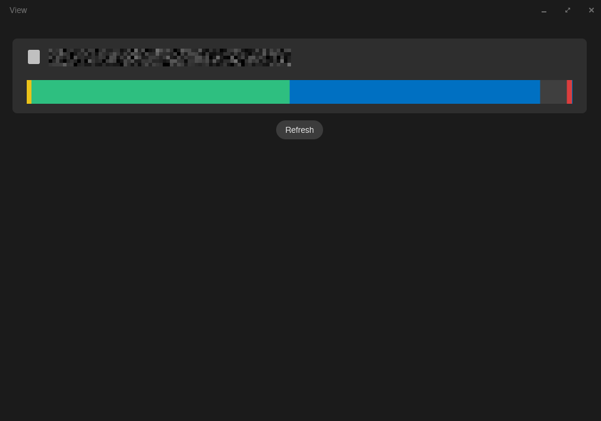

# cosmic-disks

A disk and partition manager for the [COSMIC desktop](https://github.com/pop-os/cosmic-epoch).



## Features

- Visual partition map — click any segment to see details
- Mount with options (`ro`, `noexec`, `nosuid`, `noatime`, `nodiratime`, `sync`)
- Unmount and format (ext4)
- All operations via udisks2 D-Bus — no root required

## Build

Requires the [libcosmic](https://github.com/pop-os/libcosmic) build dependencies.
Nix is the easiest way to get a working environment on any distro.

### Nix

```sh
nix develop
just run
```

### COSMIC OS / Pop!_OS (untested)

Dependencies are already present on a running COSMIC desktop:

```sh
cargo run
```

### Other distros (untested)

libcosmic is not yet packaged in most distro repos. Install the system libraries
it requires, then build with cargo:

```sh
# Debian/Ubuntu
sudo apt install pkg-config cmake libdbus-1-dev libwayland-dev libxkbcommon-dev \
  libvulkan-dev libinput-dev libudev-dev libexpat1-dev libssl-dev

# Fedora
sudo dnf install pkg-config cmake dbus-devel wayland-devel libxkbcommon-devel \
  vulkan-loader-devel libinput-devel systemd-devel expat-devel openssl-devel

# Arch
sudo pacman -S pkg-config cmake dbus wayland wayland-protocols libxkbcommon \
  vulkan-icd-loader libinput systemd-libs expat openssl
```

```sh
cargo run
```

## CLI

```sh
cosmic-disks list-disks
cosmic-disks list-volumes --format json
cosmic-disks mount /dev/sda1
cosmic-disks unmount /dev/sda1
cosmic-disks format /dev/sda1 --fs ext4
```

## License

GPL-3.0
